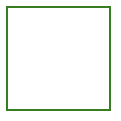
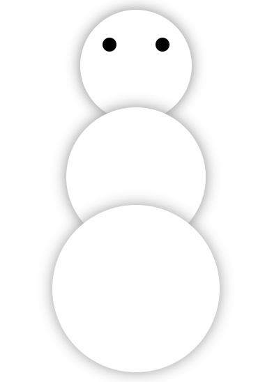
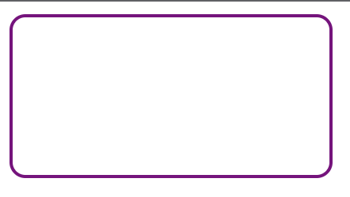
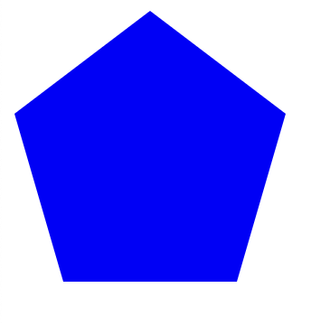
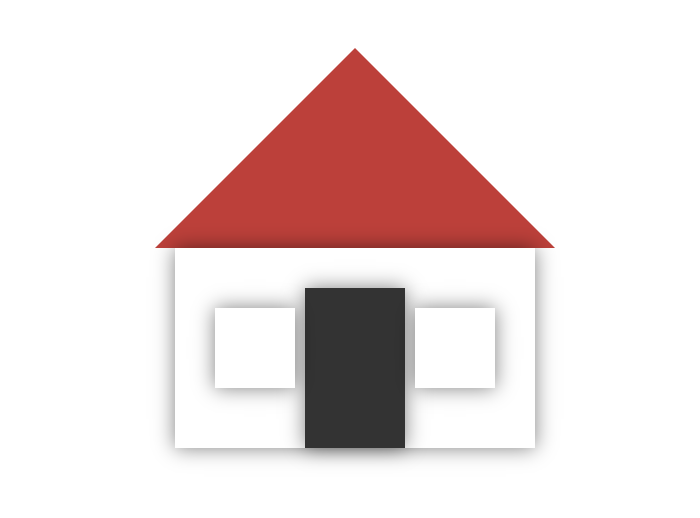
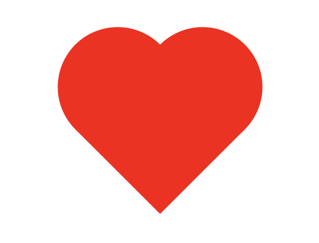
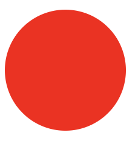

# Challenges

## Triangle

Create a triangle using CSS borders and colors.

## Square

Design a square using CSS borders and colors. Experiment with different border styles and colors to create interesting effects.

## Snowman

Create a simple snowman using CSS shapes and properties like border-radius, width, and height. Add eyes and arms to make it more fun.

## Rounded Rectangle

Design a rounded rectangle using CSS border-radius property. Play with different border widths and colors.

## Responsive Navbar

Create a responsive navigation bar using pure HTML &CSS.

## Pentagon

Design a pentagon using CSS borders and colors. Explore different shapes and angles to make it more interesting.

## House

Create a basic house with a roof, doors, and windows using CSS. Use the box-shadow property to create a 3D effect.

## Heart

Design a heart using CSS shapes and properties like border-radius and width.

## Circle

Create a circle using CSS borders and colors. Add some creative effects like gradients and shadows.

